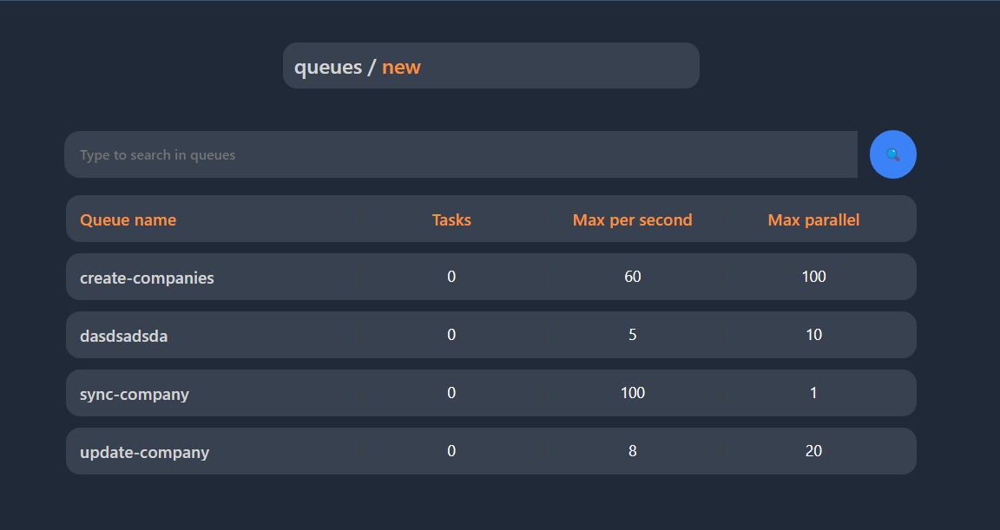

# Tusker

Task runner application supporting multiple queues, retrying, limits and many more:

- `maximum` running tasks in parallel
- `maximum` number tasks running each second
- `maximum` retries of each task
- `maximum` backoff of failed task
- `minimum` backoff after failed task

Allows delayed execution (`executor`) of tasks.

On application level queues and tasks can be created using REST Api (`api`).

Also contains simple administration where user can configure queues (`admin`).


### WARNING

Because there is no authorization yet, the application is intended to be running in your internal network **WITHOUT** exposition to the internet. Some kind of authorization and permission system is planned in future. 

## Services

Brief description of existing services.

- `api` - Deno service with REST Api for configuring queues and running tasks.
- `executor` - Deno service that executes tasks in queues.
- `admin` - Solidjs web app with administration. 

## Running application

For running application in production mode all you need is `docker` and `docker-compose`.

### Start

```bash
docker-compose up -d
```

After successfully starting application using `docker-compose` administration will listen on `localhost:80` and api on `localhost:8000`.

## Gallery



